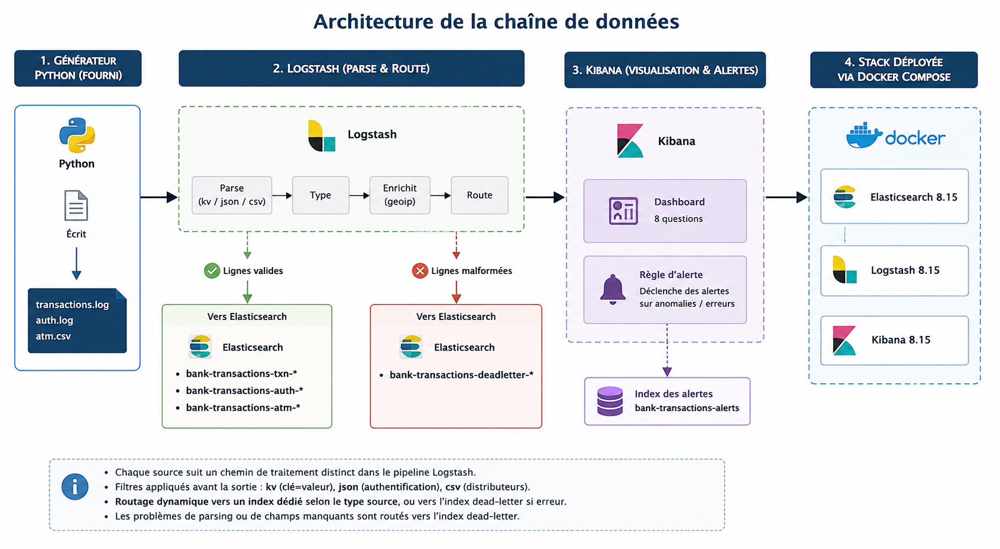

# Team — Kit: Bank Transactions ("Meridian Pay")

Pipeline ELK complet (Elasticsearch, Logstash, Kibana) pour le processeur de
paiement fictif **Meridian Pay** : ingestion de 3 sources hétérogènes,
stockage avec mappings explicites, dashboard répondant à 8 questions métier,
et alerte temps réel sur un burst de fraude.

Rapport complet: [`docs/rapport-meridian-pay.pdf`](docs/rapport-meridian-pay.pdf)

## 1. Architecture



La stack est entièrement conteneurisée (Docker Compose) : Elasticsearch 8.15,
Kibana 8.15, Logstash 8.15, un réseau Docker, un volume persistant pour les
données Elasticsearch.

**Déroulé du pipeline, étape par étape :**

1. **Génération** — le script Python fourni (`generate.py`) écrit les 3
   sources brutes (`transactions.log`, `auth.log`, `atm.csv`) dans
   `kits/bank-transactions/logs/`, avec ~2% de lignes volontairement
   malformées.
2. **Ingestion** — Logstash lit chaque fichier via un `file input` dédié
   (un par source), pour pouvoir appliquer un traitement spécifique à
   chacune.
3. **Parsing** — chaque source suit un filtre adapté à son format :
   `kv` (clé=valeur) pour les transactions, `json` pour l'authentification,
   `csv` pour les distributeurs.
4. **Typage** — les champs sont convertis vers leur type réel (`amount` en
   `float`, `card_present` en `boolean`, dates en `date`…), voir la section
   6 pour le détail du mapping.
5. **Enrichissement** — un filtre `geoip` géolocalise le champ `ip` de
   `auth.log`, pour permettre la carte des échecs d'authentification
   (question 7).
6. **Routage** — chaque ligne est aiguillée soit vers son index métier
   (`bank-transactions-txn-*`, `-auth-*` ou `-atm-*`) si elle contient tous
   les champs obligatoires, soit vers `bank-transactions-deadletter-*` sinon
   — voir section 3 pour les bugs rencontrés sur ce routage.
7. **Exploitation** — Kibana lit les index métier pour le dashboard (8
   questions) et exécute la règle d'alerte, qui écrit dans
   `bank-transactions-alerts` en cas de dépassement de seuil.

## 2. Comment lancer le projet

Deux commandes suffisent sur une machine avec Docker installé :

```bash
docker compose up -d
./scripts/seed.sh 5000
```

`seed.sh` attend qu'Elasticsearch soit prêt, applique les 5 index templates
(mappings explicites), puis lance le générateur en mode batch déterministe
(5000 événements). Logstash, déjà démarré, ingère alors automatiquement les
fichiers produits.

Vérifier que tout est monté :
```bash
curl -s 'http://localhost:9200/_cat/indices/bank-transactions-*?v'
```

Vérifier le critère d'acceptation (zéro perte) :
```bash
./scripts/verify_count.sh
```

Kibana : http://localhost:5601

Pour démontrer l'alerte en direct (mode continu, horodatage réel,
~20 événements/s) :
```bash
py kits/bank-transactions/generator/generate.py
```
Laisser tourner 2-3 minutes pour que l'anomalie périodique repasse plusieurs
fois et dépasse le seuil de l'alerte, `Ctrl-C` pour arrêter.

## 3. Ce qui a cassé, et comment on l'a corrigé

Le premier passage du pipeline a échoué : sur un batch de 5000 transactions,
2140 sont parties en dead-letter à tort et aucun document n'atteignait les
index métier. Trois bugs distincts, empilés :

1. **Fins de ligne Windows (`\r`)** — le générateur, exécuté sous Windows,
   écrit ses fichiers en mode texte ; Python y traduit chaque `\n` en `\r\n`.
   Corrigé par un `mutate/gsub` en tout début de pipeline.
2. **Conflit `dynamic: strict` vs métadonnées automatiques de Logstash** — le
   `file input` de Logstash ajoute automatiquement un champ `event.original`
   (comportement ECS par défaut). En mapping strict, Elasticsearch rejetait
   silencieusement tout document contenant ce champ imprévu, y compris des
   transactions parfaitement valides. Corrigé en retirant le champ `event` et
   en passant les mappings métier de `strict` à `false`.
3. **Piège de vérité Logstash sur la chaîne `"false"`** — le test
   `![card_present]` traite la chaîne littérale `"false"` comme fausse (donc
   "champ absent"), même quand le champ existe. ~40% des transactions (dont
   toutes les transactions frauduleuses) étaient marquées à tort comme
   incomplètes. Corrigé en retirant `card_present` de la vérification des
   champs obligatoires.

Résultat après correction, sur le même batch de 5000 transactions :

```
transactions.log : indexé=4888  lignes_fichier=5000
auth.log         : indexé=2960  lignes_fichier=3017
atm.csv          : indexé=754   lignes_fichier=754
dead-letter total : 169
---
Somme indexé (txn+auth+atm) + dead-letter = 8771
Somme lignes générées (hors en-tête csv)   = 8771
```

`169 / 8771 ≈ 1.9%`, cohérent avec le taux de ~2% de lignes volontairement
malformées annoncé par le kit. Critère d'acceptation validé à l'exact.

## 4. Choix & compromis

- **Un index par source (`index layout`)** : `bank-transactions-txn-*`,
  `-auth-*`, `-atm-*`, `-deadletter-*` et `-alerts` sont volontairement
  séparés plutôt qu'un index commun. Les trois sources métier (transactions,
  authentification, ATM) ont des **schémas et des cardinalités de requêtes
  différents** (ex. `card_present` n'a aucun sens pour un événement ATM,
  `rssi` n'existerait pas côté transactions) : les séparer permet un mapping
  explicite et adapté à chaque type d'événement, sans conflit de type entre
  sources (ex. un champ `amount` en `float` côté transactions vs un `amount`
  qui pourrait avoir une autre sémantique ailleurs). L'index dead-letter est
  isolé pour ne jamais polluer les index métier avec des documents partiels,
  et l'index alerts est isolé car il a un cycle de vie et une audience
  différents (audit/monitoring plutôt qu'analyse business).
- **`kv` plutôt que `grok`** pour `transactions.log` : le format `clé=valeur`
  s'y prête nativement, plus lisible et plus robuste aux réordonnancements de
  champs qu'un pattern grok positionnel.
- **Détection de dead-letter explicite** plutôt que de se fier uniquement aux
  tags automatiques (`_jsonparsefailure`, etc.) : `kv` ne "plante" jamais
  formellement, il faut donc vérifier soi-même la présence des champs
  obligatoires après coup.
- **`dynamic: false` plutôt que `dynamic: strict`** sur les index métier :
  garde des types stricts sur les champs qu'on connaît, sans faire échouer
  tout un document à cause d'un champ de métadonnées imprévu injecté par le
  framework (voir bug #2 ci-dessus).
- **Sécurité X-Pack désactivée** : simplifie la reproduction sur une machine
  de cours ; trade-off assumé, non représentatif d'un vrai environnement de
  production.
- **`sincedb_path => /dev/null`** : permet de rejouer les fichiers à chaque
  redémarrage de Logstash, pratique pour une démo déterministe ; en
  production on utiliserait un sincedb persistant.
- **`geoip`** appliqué uniquement sur `auth.log` (champ `ip`) en mode
  `ecs_compatibility: disabled`, pour obtenir des noms de champs stables
  (`country_name`, `location`…) compatibles avec un mapping explicite en
  `geo_point`.
- **Seuil d'alerte** : > 20 transactions déclinées en card-not-present sur
  une fenêtre glissante de 5 minutes (imposé par l'énoncé du kit), évaluée
  toutes les minutes.

## 5. Réponses aux 8 questions

| # | Question | Panel Kibana | Source / champs clés |
|---|----------|--------------|----------------------|
| 1 | Volume & valeur par devise dans le temps | Volume & valeur par devise | txn : `amount`, `currency`, `@timestamp` |
| 2 | Taux d'approbation dans le temps | Taux d'approbation dans le temps | txn : `status` (formule KQL) |
| 3 | Top 10 marchands par valeur | Top 10 marchands par valeur | txn : `merchant`, `amount` |
| 4 | Top motifs de refus | Top motifs de refus | txn : `reason` (filtre `status:declined`) |
| 5 | Card-present vs CNP par pays | Card-present vs CNP par pays | txn : `card_present`, `country_code` |
| 6 | Villes ATM / taux d'erreur | Villes ATM (cash) + Taux d'erreur ATM | atm : `city`, `op`, `result` |
| 7 | Signature de l'attaque fraude | Déclins CNP dans le temps par pays + Carte des échecs d'auth | txn + auth (geoip) croisés |
| 8 | Part de lignes dead-letter | Part de lignes dead-letter (%) | tous index : `tags:_dead_letter` |

Détail de la question 7 (signature de la fraude) et captures d'écran : voir
le rapport PDF.

## 6. Mapping des champs (index `bank-transactions-txn-*`)

Extrait des choix de type les plus significatifs — le détail complet est dans
`elasticsearch/mappings/*.json` (un fichier par index, appliqué comme index
template au démarrage).

| Champ | Type | Pourquoi |
|-------|------|----------|
| `amount` | `float` | valeur monétaire, agrégations (`sum`, `avg`) |
| `currency`, `country_code`, `status`, `reason`, `merchant` | `keyword` | valeurs catégorielles, filtrage/agrégation exacte (pas de full-text) |
| `card_present` | `boolean` | comparaison directe CP / CNP, pas de parsing de chaîne |
| `ip` (index `auth`) | `ip` | permet les requêtes par plage/sous-réseau (ex. `181.214.200.0/24`) |
| `geoip.location` (index `auth`) | `geo_point` | requis pour la visualisation carte (app Maps) |
| `@timestamp` | `date` | axe des séries temporelles, obligatoire pour tous les panels time-based |
| `message` | `text` | seul champ en full-text, pour du debug/Discover — jamais utilisé pour filtrer/agréger |

Tous les autres champs (`id`, `atm_id`, `city`, `op`, `result`, `user`,
`channel`, `tags`…) suivent la même logique : `keyword` par défaut pour tout
ce qui sert à filtrer ou grouper, jamais de mapping dynamique laissé au
hasard sur les index métier (`dynamic: false`, voir section 4).

## 7. L'alerte

- **Type** : Kibana Alerting — règle "Elasticsearch query" (KQL).
- **Data view** : `bank-txn`. **Requête** : `status: declined and card_present: false`.
- **Condition** : `count() > 20` sur une fenêtre glissante de 5 minutes,
  évaluée toutes les minutes.
- **Action** : connecteur "Index" → écrit un document dans
  `bank-transactions-alerts`.
- **Preuve de déclenchement** : démontrée en conditions réelles (générateur
  en mode continu) — voir rapport PDF pour la capture et le document JSON
  indexé.

## 8. Structure du dépôt

```
team-bank-transactions/
├── docker-compose.yml          # stack complète (ES + Kibana + Logstash)
├── README.md                   # ce fichier
├── docs/
│   └── rapport-meridian-pay.pdf
├── kits/bank-transactions/
│   ├── generator/generate.py
│   ├── logs/.gitkeep           # logs générés, ignorés par git
│   └── README.md               # énoncé original du kit
├── logstash/
│   ├── pipeline/bank-transactions.conf
│   └── config/logstash.yml
├── elasticsearch/mappings/*.json   # 5 index templates
├── kibana/dashboard.ndjson     # dashboard exporté (saved objects)
└── scripts/
    ├── seed.sh                 # LA commande de seed
    └── verify_count.sh         # vérification du critère d'acceptation
```
